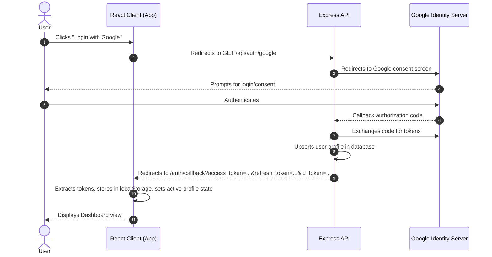

# Software Design Specification (SDS)
## React Frontend — Student Project Showcase Portal

---

## 1. Introduction

### 1.1 Purpose
This document details the frontend architecture, component layout, UX flows, and state management specifications for the **Student Project Showcase Portal**. This document serves as the guide for compiling the client SPA and integrating it with the OIDC/REST backend.

### 1.2 Target Audience
* **Developers**: To guide component creation and route configuration.
* **Faculty Assessors**: To evaluate system design patterns, visual quality, and implementation flows.
* **Maintainers**: To understand OIDC callback parsing, token refreshment, and dynamic role rendering.

---

## 2. Technology Stack & Design System

### 2.1 Technology Stack
* **Framework**: React 19 (SPA Architecture)
* **Build System**: Vite 8 (Hot Modules Replacement)
* **Styling**: Tailwind CSS v4 via `@tailwindcss/vite`
* **Icons**: `@phosphor-icons/react` for technical, clean monochrome iconography
* **UI Components**: Custom components built on Radix UI primitives
* **Typography**: Google Fonts — **JetBrains Mono** variable font, establishing a clean, developer-centric environment

### 2.2 Branding & Aesthetics
The portal utilizes a dark, premium aesthetic centered around the **Faculty of Computing's calm Maroon theme**.

| Styling Token | Tailwind Class | HEX Value | Description |
|---|---|---|---|
| Deep Dark Background | `bg-zinc-950` | `#09090b` | Primary window backdrop |
| Secondary Container | `bg-zinc-900` | `#18181b` | Cards, sidebars, headers |
| Highlight Border | `border-zinc-800`| `#27272a` | Separation lines, grid splits |
| Primary Accent | `bg-maroon` | `#800000` | CTA buttons, primary tags |
| Accent Hover | `hover:bg-maroon-light`| `#a32a2a` | Hover states |
| Subdued Accent | `bg-maroon/10` | `#8000001a`| Soft badges, unread backdrops |

---

## 3. UI Component Architecture

```text
                               +-------------------------------------+
                               |              App.jsx                |
                               +-------------------------------------+
                                                  |
                         +------------------------+------------------------+
                         |                                                 |
            +------------v------------+                       +------------v------------+
            |      Login Card         |                       |     Dashboard View      |
            +-------------------------+                       +-------------------------+
            | - Email & Password Form |                       | - Header (Profile Tag)  |
            | - Magic OTP Verification|                       | - Notifications Slideout|
            | - Sign Up Role Switcher |                       | - Active Claims Parser  |
            | - Google Sign-In button |                       | - Log Console Panel     |
            +-------------------------+                       +-------------------------+
                                                                           |
                                            +------------------------------+------------------------------+
                                            |                              |                              |
                               +------------v------------+    +------------v------------+    +------------v------------+
                               |     Student Showcase    |    |     Recruiter Actions   |    |    Admin Control Panel  |
                               +-------------------------+    +-------------------------+    +-------------------------+
                               | - Create Project Form   |    | - Public Projects Feed  |    | - Stats Dashboard Card  |
                               | - Project Grid View     |    | - Student Profile Modals|    | - Users & Roles Table   |
                               | - Upload Thumbnail Btn  |    | - Like & Follow Toggles |    | - Moderation Visibility |
                               +-------------------------+    +-------------------------+    +-------------------------+
```

### 3.1 Views & Layouts
1. **Login Card View (`login_email` & `login_otp` state)**:
   * Displays the brand emblem and primary authentication tabs: **Password Sign In**, **Magic Link (OTP)**, and **Register**.
   * Integrates the Google Sign-in button redirecting directly to `/api/auth/google`.
2. **Dashboard Layout (`dashboard` state)**:
   * **Header**: Shows current user's profile details (Avatar, Email, and dynamic RBAC Role). Includes the Logout button.
   * **Left Panel**: Identity Context, active JWT claims visualizer (ID token parser), and navigation links.
   * **Center/Right Panel**: Dynamic UI panels rendered conditionally based on the user's role (Student CRUD, Recruiter Feed, Admin DB Manager).
   * **Bottom Log Stream**: Terminal log console rendering real-time HTTP requests, response statuses, and refresh token events.

---

## 4. Navigation & Flow Design

### 4.1 Authentication & Google OAuth Flow


### 4.2 Local Auth Parsing (`useEffect` in [App.jsx](file:///c:/Users/sachin%20lakshitha/webproject/frontend/src/App.jsx))
```javascript
useEffect(() => {
  // Capture tokens from redirection URL
  if (window.location.pathname === '/auth/callback') {
    const params = new URLSearchParams(window.location.search);
    const accessToken = params.get('access_token');
    const refreshToken = params.get('refresh_token');
    const idToken = params.get('id_token');
    
    if (accessToken && refreshToken && idToken) {
      setAccessToken(accessToken);
      setRefreshToken(refreshToken);
      setIdToken(idToken);
      
      // Clean up URL parameter history
      window.history.replaceState({}, document.title, "/");
    }
  }
}, []);
```

---

## 5. State Management & API Interceptor

### 5.1 Application State Schema
* **Authentication State**:
  * `accessToken`: String, bearer token stored in memory/session.
  * `refreshToken`: String, long-lived token stored in `localStorage` for refresh flow.
  * `idToken`: String, OpenID token containing signed user info claims.
  * `userProfile`: Object containing `{ id, email, name, avatar_url, role, permissions[] }`.
* **Resource State**:
  * `projects`: Array of public showcase projects.
  * `notifications`: Array of student-specific engagement activities.
  * `adminStats` & `usersList`: Managed entities for admin panels.

### 5.2 Token Refresh Wrapper (`apiCall`)
To prevent session dropouts, API requests are made using a wrapper that automatically requests token renewal when an expired access token response (`TOKEN_EXPIRED`) is received:

```javascript
const apiCall = async (endpoint, options = {}) => {
  let headers = {
    'Content-Type': 'application/json',
    ...options.headers,
  };
  
  if (accessToken) {
    headers['Authorization'] = `Bearer ${accessToken}`;
  }

  let response = await fetch(`${API_URL}${endpoint}`, { ...options, headers });
  let data = await response.json();

  if (response.status === 401 && data.code === 'TOKEN_EXPIRED') {
    // Attempt Token Renewal
    const refreshResponse = await fetch(`${API_URL}/auth/refresh`, {
      method: 'POST',
      headers: { 'Content-Type': 'application/json' },
      body: JSON.stringify({ refresh_token: refreshToken })
    });
    
    const refreshData = await refreshResponse.json();
    
    if (refreshResponse.ok) {
      setAccessToken(refreshData.access_token);
      setRefreshToken(refreshData.refresh_token);
      setIdToken(refreshData.id_token);
      
      // Retry original request with new token
      headers['Authorization'] = `Bearer ${refreshData.access_token}`;
      response = await fetch(`${API_URL}${endpoint}`, { ...options, headers });
      data = await response.json();
    } else {
      handleLogout();
      throw new Error('Session expired, please login again.');
    }
  }
  
  if (!response.ok) throw new Error(data.error || 'Request failed');
  return data;
};
```

---

## 6. Functional Page Designs

### 6.1 Project Showcase & Feed
* Displays public cards including Project title, Description, Author details, Thumbnail, and Likes counter.
* **Likes Toggle**: Triggered by clicking the heart/thumbs-up icon. Prevents multiple entry submissions through immediate local state updating.
* **File Upload Validation**: Enforces image file constraints before transmitting payloads to `/api/projects/:id/thumbnail`:
  * Limit file sizes strictly to `5MB`.
  * Validate MIME types to matches `image/(jpeg|png|webp|gif)`.

### 6.2 Notifications Slide-over Panel
* Fetches alerts from `GET /api/users/notifications`.
* Renders real-time unread count badges.
* Groups alerts into read/unread sections.
* Includes "Mark as read" and "Mark all as read" API button hooks.

### 6.3 Admin Panel (RBAC Control Grid)
* Includes stats card dashboard (counting users, project posts, total likes, and active follows).
* Renders user directory with dropdown menus to instantly adjust user access permissions via roles:
  * Selecting **Admin (1)**, **Recruiter (2)**, or **Student (3)** initiates a `PUT /api/admin/users/:id/role` call.
  * System alerts provide instant feedback of dynamic database-level role re-evaluations.
